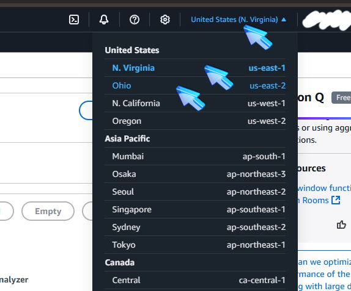
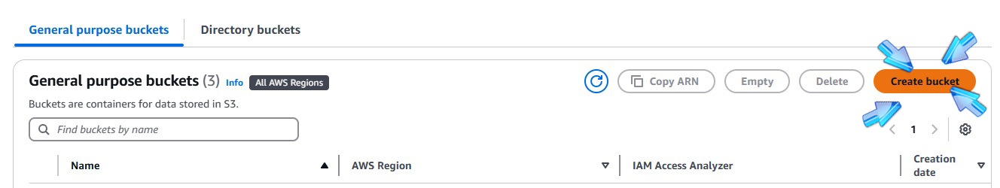
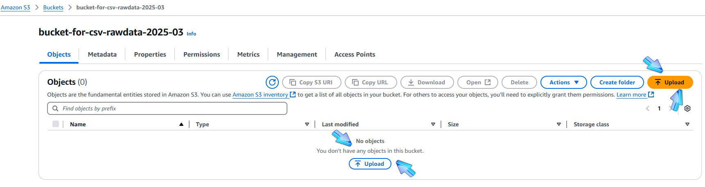
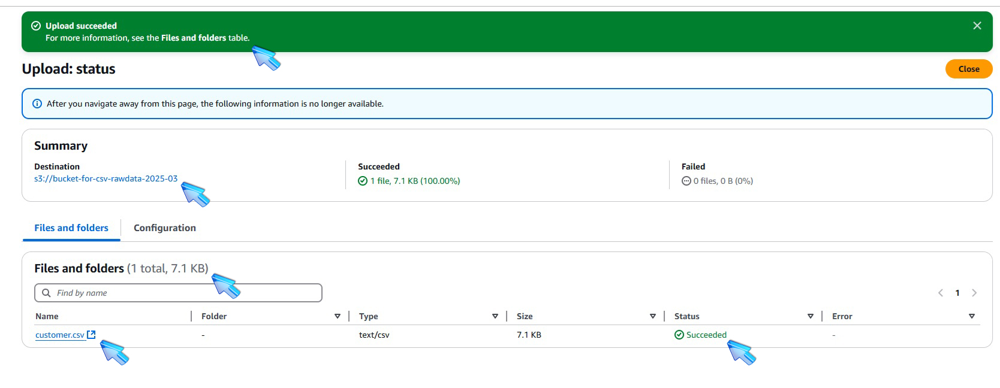
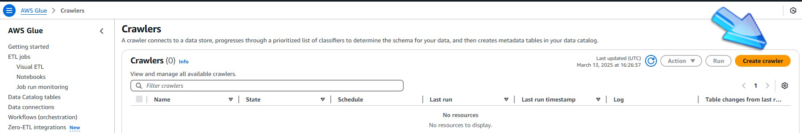
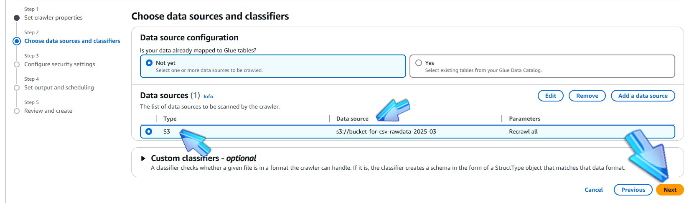
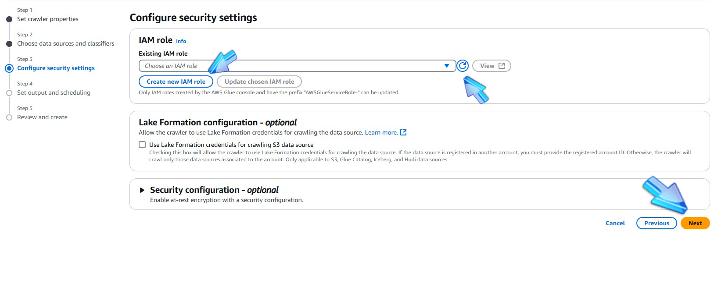
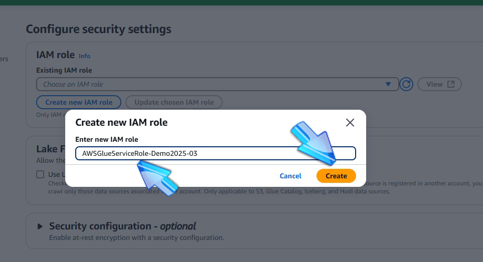
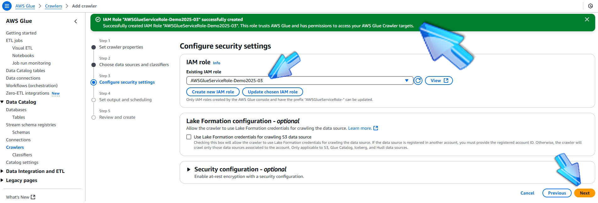

## LAB DeepSeekR1 >> AWS S3 >> AWS Glue Crawler >> AWS Glue Database >> AWS Athena >> SQL

    
   @@@ Doações: Pix: altaperformancenubank@gmail.com 

 

<h2> 🤖 Tecnologias utilizadas</h2>

  
  
  <!-- 
-->

# 1 - DeepSeekR1

######  
##### ** Gerar o conteúdo do arquivo *customer.csv:* ** 
###### - Abra o link *https://chat.deepseek.com/*
###### - Use o prompt providenciado no arquivo *PromptedDeepSeekR1.md* no DeepSeekR1 e espere ele gerar a lista de dados...
###### - Cole no DeepSeekR1 o conteúdo do jeito que você copiar do arquivo  a AI vai tratar de acordo.
###### - Copie a lista de dados que o DeepSeekR1 gerar e cole em um editor de texto, salve como *customer.csv*, o arquivo será usado em breve.

######  
##### ** Generate the data for the file *customer.csv:* ** 
###### - Open the url *https://chat.deepseek.com/*
###### - Look at the prompt provided in the file , copy and paste it in DeepSeekR1, wait it generate the list of data...
###### - Paste the prompt without modifications in DeepSeekR1, the AI will manage it.
###### - Copy the list of data in a text editor and save it as *customer.csv*, it will be used later.

# 2 - Amazon S3 

######  
##### ** Abra o Amazon S3 no console da Amazon **

######  
##### ** Open the Amazon S3 console **

# 2.1 - Amazon S3 - Create Buckets 

######  
##### ** Escolha a Região na AWS para criar dois buckets **
###### Escolha qualquer uma, eu tenho buckets em Ohio e North Virginia 
###### e depois de escolher a região, clique no botão *Create Bucket*
###### crie dois buckets:
###### - um para receber o arquivo 
###### - o segundo bucket irá receber arquivos gerados pelo AWS ATHENA.
###### - usado os nomes : *bucket-for-csv-rawdata-2025-03* e *bucket-for-athena-queries-2025-03*

######  
##### ** Choose a AWS Region to create two buckets **
###### I have a couple of buckets in North Virginia and Ohio.
###### after choosing the region, click in the *Create Bucket* button.
###### create two buckets:
###### - one to receive the file 
###### - other will receive files created by AWS ATHENA.
###### - used the names : *bucket-for-csv-rawdata-2025-03* and *bucket-for-athena-queries-2025-03*

# 2.2 - Amazon S3 Upload 

######  
##### ** Clique no botão upload para escolher o arquivo  **
###### - depois que escolher o arquivo e também após fazer o upload, algumas informações relevantes sobre ele aparecem na tela.
###### - abra o bucket *bucket-for-csv-rawdata-2025-03* e confira o arquivo  salvo no bucket.

######  
##### ** Click on upload button to choose the file  **
###### - after choosing the file and also after uploading, some relevant information appears on the screen.
###### - open the bucket *bucket-for-csv-rawdata-2025-03* and check the file  saved in the bucket.

# 3 - AWS Glue 

######  
###### Abra o AWS GLUE
###### Abra no menu lateral o item CRAWLERS

######  
###### Open the AWS GLUE
###### Open CRAWLERS in lateral menu

# 3.1 - AWS Glue - Create Crawler

######  
###### Clique em CREATE CRAWLER

######  
###### Click CREATE CRAWLER

# 3.2 - AWS Glue - Crawler Properties

######  
###### Preencha as informações para parametrizar o Crawler

######  
###### Fill in the information to parameterize the Crawler

# 3.3 - AWS Glue - Crawler DATA SOURCE Configuration

######  
###### Clique no botão *add a Data Source* para poder indicar a fonte dos dados.

######  
###### Click on the *add a Data Source* button to indicate the data source.

######  
###### Faça a parametrização do *Data Source* com o bucket *bucket-for-csv-rawdata-2025-03*
###### Clique no botão *ADD an S3 data source*. 

######  
###### Parameterize the *Data Source* with the bucket *bucket-for-csv-rawdata-2025-03*
###### Click on the *ADD an S3 data source* button. 

######  
###### Confira a parametrização do *Data Source* com o bucket *bucket-for-csv-rawdata-2025-03*

######  
###### Check *Data Source* parametrization with the bucket *bucket-for-csv-rawdata-2025-03*

######  
###### Nas configurações de segurança crie uma IAM ROLE para AWS GLUE.
###### Confira as configurações realizadas.

######  
###### In security settings create a IAM ROLE for AWS GLUE.
###### Check the settings.

